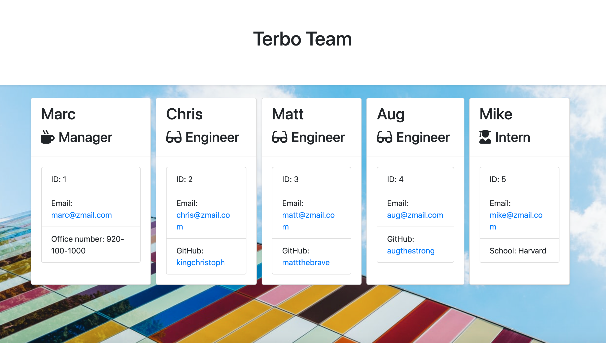

# Terbo-Team
An application that displays profile information about your code team, Terbo Team!

## Project Details

Welcome to Terbo-Team! 

Terbo-Team was created to help you display information about you and your code team! Your code team will help you get through the challenges in life, and should be displayed proudly for everyone to see, as buddies for life! Simply enter the required information for your team, and it will be displayed in a rapidly generated html file. Give it a shot! 

Thanks for stopping in! I look forward to working together to make the present and future a better place.

## Instructions

Intro Video: 

Instructions:

1. 
2.
3.

## Build Details

This application was developed using: Node.js, Inquirer, JavaScript, Testing, HTML, CSS, and more! 

## Repository & Preview

View the repository at: https://github.com/MichaelWitt/Terbo-Team

Preview: 
Demo: 

## Updates

You can find project updates in the repository, highlighting what was done to create the final product.

https://github.com/MichaelWitt/Terbo-Team/commits/

## Credits

UNC Coding Bootcamp And Trilogy for the inspiration! 

Background photo by Scott Webb @scottwebb from Unsplash.

Thanks! 

## Thanks For Visiting!

Come back soon :)
